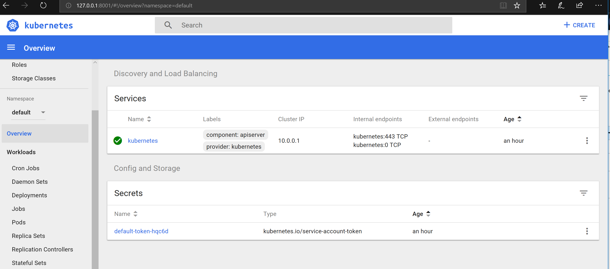

# Hosting the eShopOnContainers Application

The logic supporting the eShopOnContainers application can be supported by Azure using a variety of services. The recommended approach is leverage Kubernetes using Azure Kubernetes Service. This can be combined with Helm deployment to ensure easily repeated infrastructure configuration. Optionally, developers can leverage DevSpaces for Kubernetes as part of their development process. Another option is to host the functionality of the app using Azure Serverless features like Azure Functions and Azure Logic Apps. All of this should be configured to run automatically when new code is checked into source control, using Azure DevOps build pipelines and releases.

## Azure DevOps Build Pipelines

Each of the individual microservices in the eShopOnContainers application has its own build pipeline in Azure DevOps. The instructions for the build are checked into GitHub alongside the code itself. You'll find the individual build instructions in the `/build/azure-devops` folder in the project's GitHub repository. An example of the WebMVC project's build file is shown in Figure 3-x.

```yml
variables:
    registryEndpoint: eshop-registry
trigger:
  branches:
    include:
    - master
    - dev
  paths:
    include:
    - src/BuildingBlocks/*
    - src/Web/WebMVC/*
    - k8s/helm/webmvc/*    
jobs:
- template: ../buildimages.yaml
  parameters:
    services: webmvc
    registryEndpoint: $(registryEndpoint) 
- template: ../multiarch.yaml
  parameters:
    image: webmvc
    branch: $(Build.SourceBranchName)
    registryEndpoint: $(registryEndpoint)
```

**Figure 3-x**. WebMVC azure-pipelines.yml file.

This build leverages common `buildimages.yaml` and `multiarch.yaml` files and passes in parameters specific to this project. The common build files create and deploy the Docker images using Docker build and Helm charts. These builds are configured in Azure DevOps to trigger both in response to pull requests and after a commit is made to the main branch (dev or master, typically). Having builds triggered on pull requests helps ensure that code in pull requests has no problems **before** it's merged into the main branch for the application.

## Azure Kubernetes Service

The application can be hosted on AKS. There are detailed instructions in the GitHub repository's wiki. The essential steps are to create a new Kubernetes cluster in your Azure subscription. It's important that you enable role-based access control (RBAC) when you do so, whether from the CLI or in the portal. You should also enable application routing. If you're using the portal, RBAC is configured under the Authentication tab and HTTP application routing is under the Networking tab.

After creating the cluster, you need to configure access to the Kubernetes dashboard by granting rights to the Service Account. Once that's done, you can browse to the Kubernetes dashboard using a command like:

```cli
az aks browse --resource-group <resourcegroup> --name <clustername>
```

The result should be access to the dashboard, as shown in Figure 3-x.


**Figure 3-X**. Azure Kubernetes Dashboard.

## Helm Deployment

The eShopOnContainers project includes the necessary Helm charts to configure and deploy the application to a Kubernetes cluster. In order to use Helm, you must have it installed on your machine. Since the application is using an RBAC-enabled AKS cluster, it's also necessary to have Tiller installed in AKS and bound to a service account. [See the docs](https://docs.microsoft.com/azure/aks/kubernetes-helm#secure-tiller-and-helm) for detailed instructions on configuring these services.

Assuming the required services are installed and configured, you can install eShopOnContainers using Helm with scripts found in the `/k8s/helm` folder of the project. For example, the following command will install all of the eShopOnContainers public images using PowerShell:

```powershell
.\deploy-all.ps1 -externalDns aks -aksName eshoptest -aksRg eshoptest -imageTag dev
```

## Dev Spaces for Kubernetes

Once you have a Kubernetes cluster configured in Azure, you can enable Azure Dev Spaces using the Azure CLI. There are [detailed instructions in the eShopOnContainers wiki](https://github.com/dotnet-architecture/eShopOnContainers/wiki/10.1-Using-Azure-Dev-Spaces-and-AKS), but the basic steps are as follows:

- Enable Dev Spaces for your AKS cluster
- Prepare your environment by running ./src/prepare-devspaces.ps1
- Deploy to a Dev Space (using same Helm charts as above)
- Deploy customization to your own child Dev Space by selecting it and then running `azds up`
- Access your custom Dev Space using its URL prefix: `childname.s.`

With Azure Dev Spaces, you can work on your entire application's Kubernetes cluster, hosted in Azure. You can make changes to individual services or containers and then run and test your customized cluster from your own URL.

## References

- [Install apps with Helm in AKS](https://docs.microsoft.com/azure/aks/kubernetes-helm)
- [eShopOnContainers Wiki](https://github.com/dotnet-architecture/eShopOnContainers/wiki)

>[!div class="step-by-step"]
>[Previous](mapping-eshoponcontainers-to-azure-services.md)
>[Next](centralized-configuration.md)
