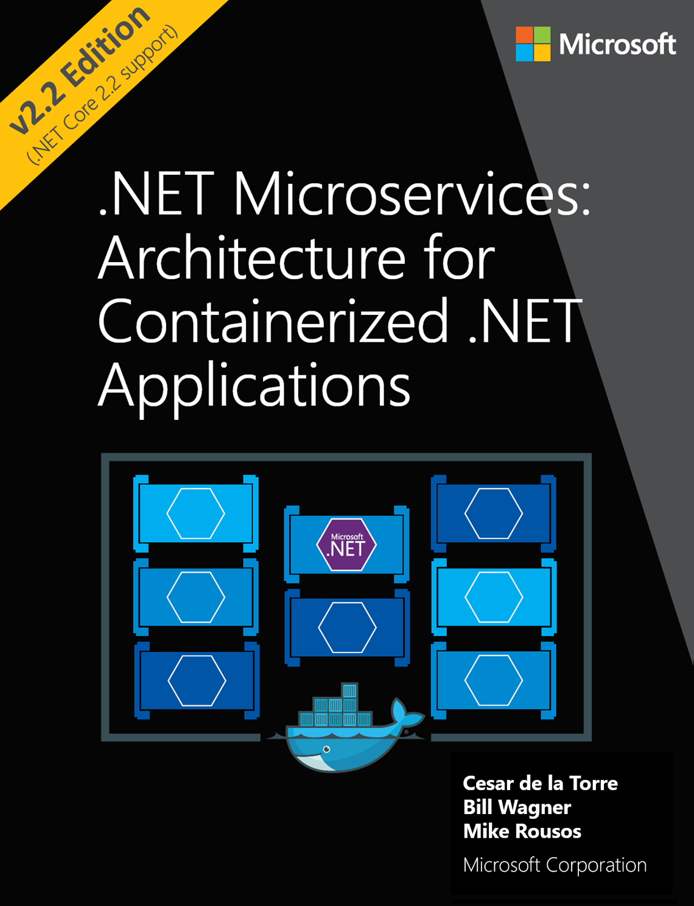

# Architecting Cloud Native .NET Applications for Azure

PUBLISHED BY

Microsoft Developer Division, .NET, and Visual Studio product teams

A division of Microsoft Corporation

One Microsoft Way

Redmond, Washington 98052-6399

Copyright © 2019 by Microsoft Corporation

All rights reserved. No part of the contents of this book may be reproduced or transmitted in any form or by any means without the written permission of the publisher.

This book is provided “as-is” and expresses the author’s views and opinions. The views, opinions and information expressed in this book, including URL and other Internet website references, may change without notice.

Some examples depicted herein are provided for illustration only and are fictitious. No real association or connection is intended or should be inferred.

Microsoft and the trademarks listed at https://www.microsoft.com on the “Trademarks” webpage are trademarks of the Microsoft group of companies.

Mac and macOS are trademarks of Apple Inc.

The Docker whale logo is a registered trademark of Docker, Inc. Used by permission.

All other marks and logos are property of their respective owners.

Author:

> **Steve "ardalis" Smith** - Software Architect and Trainer - [Ardalis.com](https://ardalis.com)
> **Robert Vettor** - Microsoft

Editors:

> **John Doe**

## Introduction

TODO

## Purpose

TODO

## Who should use this guide

**UPDATE THIS**

The audience for this guide is mainly developers, development leads, and architects who are interested in building modern web applications using Microsoft technologies and services in the cloud.

A secondary audience is technical decision makers who are already familiar ASP.NET or Azure and are looking for information on whether it makes sense to upgrade to ASP.NET Core for new or existing projects.

## How you can use this guide

**UPDATE THIS**

This guide has been condensed into a relatively small document that focuses on building web applications with modern .NET technologies and Windows Azure. As such, it can be read in its entirety to provide a foundation of understanding such applications and their technical considerations. The guide, along with its sample application, can also serve as a starting point or reference. Use the associated sample application as a template for your own applications, or to see how you might organize your application's component parts. Refer back to the guide's principles and coverage of architecture and technology options and decision considerations when you're weighing these choices for your own application.

Feel free to forward this guide to your team to help ensure a common understanding of these considerations and opportunities. Having everybody working from a common set of terminology and underlying principles helps ensure consistent application of architectural patterns and practices.

## References

- **Choosing between .NET Core and .NET Framework for server apps**  
  <https://docs.microsoft.com/dotnet/standard/choosing-core-framework-server>

>[!div class="step-by-step"]
>[Next](introduction-to-cloud-native-applications.md)