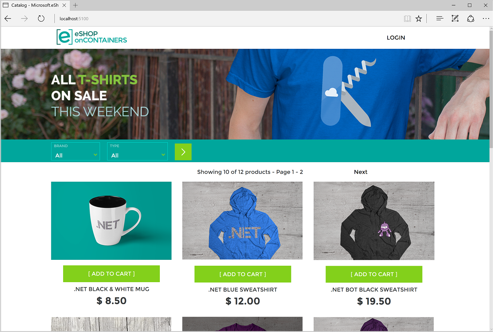
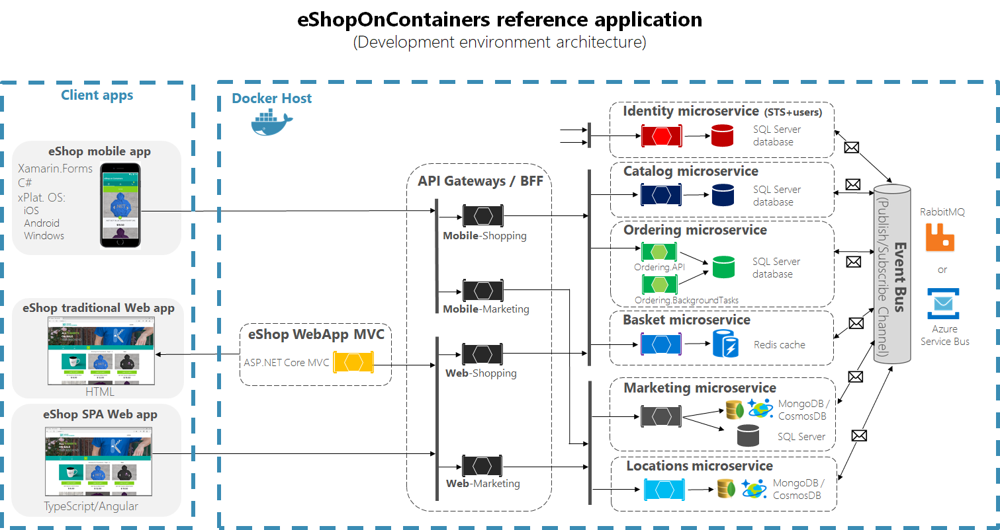
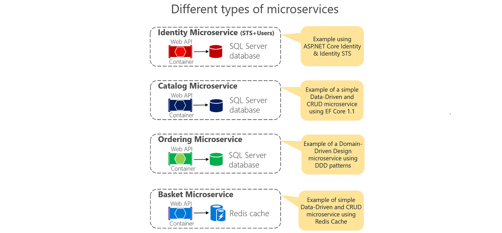
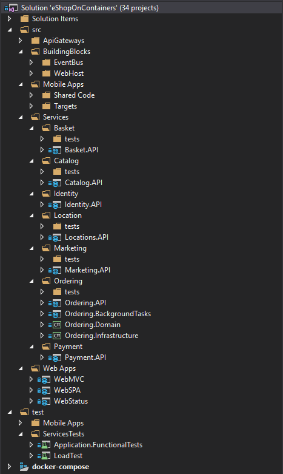

# Introducing eShopOnContainers Reference App

Microsoft, in partnership with leading community experts, has produced a full-featured cloud native microservices reference application, eShopOnContainers. This application is built to showcase using .NET Core and Docker, and optionally Azure, Kubernetes, and Visual Studio, to build an online storefront.

**Figure 3-1**. eShopOnContainers Sample App Screenshot.

## Features and Requirements

Let's start with a review of the application's features and requirements. The eShopOnContainers application represents an online store which sells various physical products like t-shirts and coffee mugs. If you've bought anything online before, the experience of using the store should be relatively familiar. Here are some of the basic features the store implements:

- List catalog items
- Filter items by type
- Filter items by brand
- Add item to shopping basket
- Edit/remove items in basket
- Checkout
- Register an account
- Log in
- Log out
- Review orders

The application also has non-functional requirements. It needs to be highly available and it must scale automatically to meet increased traffic (and scale back down once traffic subsides). It should provide easy-to-use monitoring of its health as well as diagnostic logs to help troubleshoot any issues it encounters. It should support an agile development process, including support for continuous integration and deployment (CI/CD). In addition to the two web front ends (traditional and Single Page Application), the application must also support mobile client apps running a variety of operating systems. It should support cross-platform hosting as well as cross-platform development.

**Figure 3-2**. eShopOnContainers reference application development architecture.

The eShopOnContainers application is accessible from web or mobile clients which access the application over HTTPS targeting either the ASP.NET Core MVC server application or an appropriate API Gateway. API Gateways offer several advantages, such as decoupling backend services from individual front end clients and providing better security. The application also makes use of a related pattern known as Backends-for-Frontends (BFF), which recommends creating separate API gateways for each front end client. The reference architecture demonstrates breaking up the API gateways based on whether the request is coming from a web or mobile client.

The application's functionality is broken up into a number of distinct microservices. There are services responsible for authentication and identity, for listing items from the product catalog, and managing users' shopping baskets, and for placing orders. Each of these separate services has its own persistent storage. Note that there is no single master data store with which all services interact. Instead, coordination and communication between the services is done on an as-needed basis and through the use of a message bus.

The different microservices each are designed differently, based on their individual requirements. This means their technology stack may differ, though they're all built using .NET Core and designed for the cloud. Simpler services provide basic CRUD (Create-Read-Update-Delete) access to underlying data stores, while more advanced services use Domain-Driven Design approaches and patterns to manage business complexity.

**Figure 3-3**. Different kinds of microservices.

## Overview of the Code

Because it leverages microservices, the eShopOnContainers app includes quite a few separate projects and solutions in its GitHub repository. In addition to separate solutions and executable files, the various services are designed to run inside their own containers, both during local development and at runtime in production. Figure 3-4 shows the full Visual Studio solution, in which the various different projects are organized.

**Figure 3-4**. Projects in Visual Studio solution.

The solution includes two web front end variants, a traditional server-rendered MVC app and a Single Page Application (SPA) built with Angular and TypeScript. It also includes three mobile front end applications, built for Android, iOS, and Universal Windows (UWP). The *Services* folder containers tha application's microservice back ends. These are ASP.NET Core apps built to expose Web APIs, and each one is self-contained and includes its own data source. These data source implementations range from SQL Server to Redis.

The code repository includes several different solution files, so you can focus on a specific area of the overall application. The most commonly used solution is the `eShopOnContainers-ServicesAndWebApps` solution, which focuses on the back end services, API gateways, and web applications. Each solution includes a docker-compose project as well which is used by default when you run the application from Visual Studio. This command will build and run all of the necessary container instances to run the application locally in Docker containers. The container instances involved in running this solution include:

- A [Seq endpoint](https://datalust.co/seq)
- A SQL Server instance
- A MongoDB instance
- A Redis instance
- A RabbitMQ instance
- An Identity API service
- A Basket API service
- A Catalog API service
- An Ordering API service
- An Ordering Background Task 
- A Marketing API service
- A Payment API service
- A Locations API service
- A Webhooks API service
- API Gateways for mobile shopping and marketing
- API Gateways for web shopping and marketing
- Aggregators for mobile and web gateways
- An Ordering SignalR hub service
- A web status service
- A SPA service
- An MVC service
- A Webhooks client service

Obviously, running all of these services may require significant resources on your development machine. See the [eShopOnContainers application Wiki](https://github.com/dotnet-architecture/eShopOnContainers/wiki) for dev machine requirements and notes for getting started, including how to run the application in Azure using Azure Dev Spaces and AKS.

## References

- [eShopOnContainers GitHub Project](https://github.com/dotnet-architecture/eShopOnContainers)

>[!div class="step-by-step"]
>[Previous](implementing-a-cloud-native-app.md)
>[Next](mapping-eshoponcontainers-to-azure-services.md)
