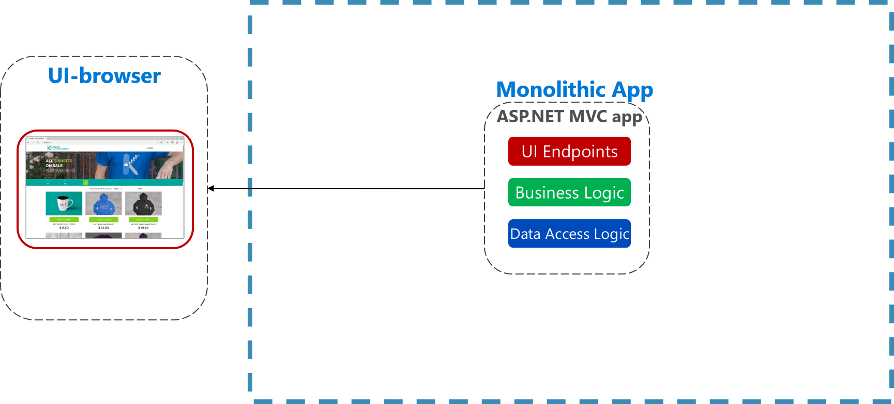
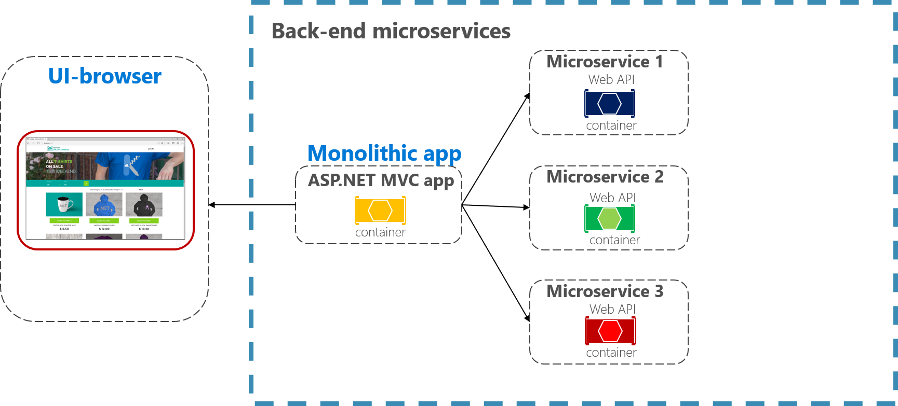
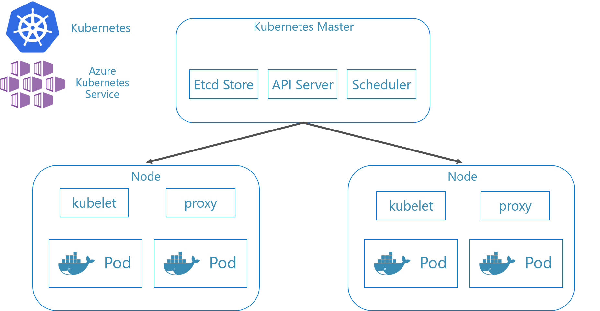

# Leveraging Containers and Orchestrators

Docker is the most popular container management and imaging platform and allows you to quickly work with containers on Linux and Windows. Containers provide separate but reproducible application environments that will run the same way on any system. This makes them perfect for hosting and scaling applications and app components in cloud native applications. Containers are isolated from one another, so two containers on the same host hardware can have completely different versions of software and even operating system installed, without the dependencies causing conflicts.

What’s more, containers are completely defined by simple files that can be checked into source control. Unlike full servers, even virtual machines, which frequently require manual work to apply updates or install additional services, container infrastructure can easily be version-controlled. Thus, apps built to run in containers can developed, tested, and deployed using automated tools as part of a build pipeline.

Containers are immutable. Once you have a definition of a container, you can recreate that container and it will run exactly the same way. This immutability lends itself to component-based design. If some parts of an application don’t change as often as others, why redeploy the entire app when you can just deploy the parts that change most frequently? A typical monolithic application is deployed as a single unit, despite typically being composed of several modules or assemblies, as shown in Figure 2-4.

**Figure 2-4**. Monolithic architecture.

Multi-tier architectures are nothing new, but with container-based applications it may make sense at a minimum to separate different tiers into separate containers, or to split an app into different containers based on features or cross-cutting concerns. Figure 2-5 shows how a monolithic app can take advantage of containers and microservices by delegating certain features or functionality. The remaining functionality in the app itself has also been containerized.

**Figure 2-5**. Breaking up a monolithic app to use microservices in the backend.

Once you start to have multiple containers that need to work together, it can be worthwhile to organize them at a higher level. By design containers only know about themselves. Organizing large numbers of containers and their shared dependencies, such as network configuration, is where orchestration tools come in to save the day! Kubernetes is a container orchestration platform designed to automate deployment, scaling, and management of containerized applications. It creates an abstraction layer on top of groups of containers, which it organized into what it calls *pods*. Pods run on worker machines referred to as *nodes*. The whole organized group is referred to as a *cluster*. Figure 2-6 shows the different components of a Kubernetes cluster.

**Figure 2-6**. Kubernetes cluster components.

## Docker Desktop

Kubernetes Minikube and Kubernetes Server from Docker Desktop

## Visual Studio Docker Tooling

## References

- [What is Kubernetes?](https://blog.newrelic.com/engineering/what-is-kubernetes/)

>[!div class="step-by-step"]
>[Previous](scaling-cloud-native-dotnet-applications.md)
>[Next](leveraging-serverless-functions.md)
