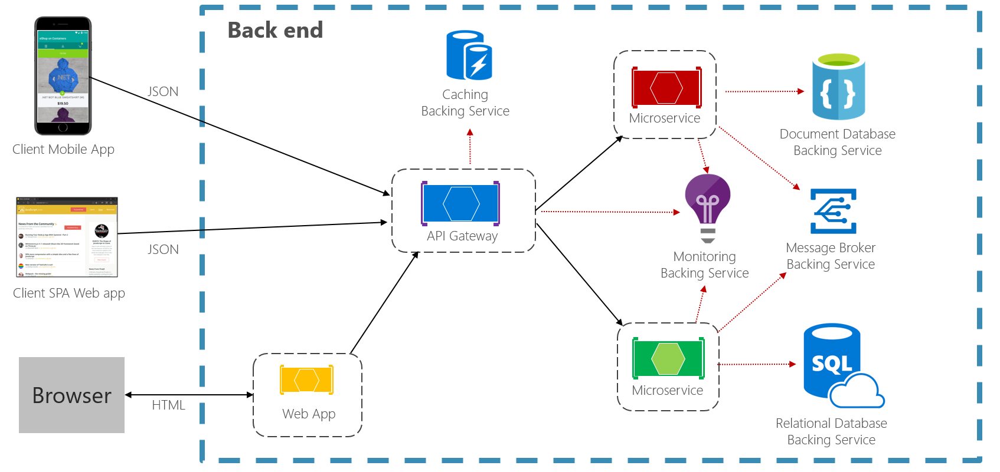

# Cloud Native Resiliency

Resiliency is the ability to for your system to react to failure and still remain functional. It isn't about avoiding failure but accepting the fact that failure is inevitable and building systems that can respond to it in order to avoid downtime or data loss. The end-goal of resiliency is to return the application to a fully functioning state after such a failure partial failure.

Unlike traditional monolithic applications, where everything runs together in a single process, cloud native systems embrace distributed architecture as depicted below in Figure 6-1.

**Figure 6-1.** Distributed Cloud Native Environment

In the figure above, note how each client, microservice and cloud-based backing service is an independent, separate process, often running on a separate server, all communicating via network-based calls.

So what could go wrong?

-   Unexpected [network
    latency](https://www.techopedia.com/definition/8553/network-latency)

-   [Transient
    faults](https://docs.microsoft.com/en-us/azure/architecture/best-practices/transient-faults)
    (temporary network connectivity errors)

-   Blocking by long-running synchronous operations

-   A host process that crashes and needs to be restarted or moved

-   An overloaded microservice that cannot respond for a short time

-   An in-flight DevOps operation such as an update or scaling operation

-   An Orchestrator operation such as moving a service from one node to another

-   Hardware failures from commodity hardware

When deploying distributed services into cloud-based infrastructure, the factors listed above become very real and you absolutely need to architect and develop defensively to deal with them.

In a small-scale distributed system, failure will be less frequent, but as the system scales up and out, you can bank on encountering such issues to the point where that partial failure becomes part of normal operation.

Therefore, your application and infrastructure must be resilient. In the following sections we’ll explore both application and cloud infrastructure resiliency.

Resiliency is the ability to for your system to react to problems and still remain functional. It isn't about avoiding failures but accepting the fact that failures are invetiable and responding to them in a way that avoids downtime or data loss. The goal of resiliency is to return the application to a fully functioning state after a failure.

As discussed in Chapter 1, cloud native systems embrace distributed architecture: Independent microservices interacting with cloud-based [backing services](https://12factor.net/backing-services) communicating over a network layer. 

It's challenging to design and deploy a distributed cloud-native application. And, it’s equally challenging to keep that application running in an environment where failure is certain. Consider what can go wrong:

-	Unexpected [Network Latency](https://www.techopedia.com/definition/8553/network-latency) network latency
-	[Transient faults](https://docs.microsoft.com/en-us/azure/architecture/best-practices/transient-faults) (temporary network connectivity errors)
-	Blocking by long-running synchronous operations
-	A host process that crashes and needs to be restarted or moved
-	An overloaded microservice that cannot respond for a short time
-	An in-flight DevOps operation such as an update or scaling operation
-	An Orchestrator operation such as moving a service from one node to another
-	Hardware failures from commodity hardware

In a small-scale distributed system, failures will be less common. But as the system grows in scale, you can bank on an increasing number of problems such that the partial failure becomes a normal mode of operation.

Therefore, your application and infrastructure must be resilient. In the following sections we’ll explore both application and cloud infrastructure resiliency.

>[!div class="step-by-step"]
>[Previous](azure-data-storage.md)
>[Next](application-resiliency-patterns.md)
